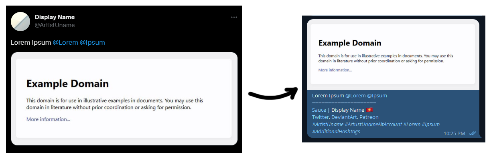

# social-2-telegram

A CLI tool for reposting artworks from social media to Telegram.



## Highlights
- 🌎 Multiplatform support: 𝕏, FurAffinity
- 👥 Artists w/ multiple handles
- 🖼️ Multiple images from one post
- 🔖 Additional hashtags on top of the original post's hashtags
- 🆔 Getting artists' usernames from handles
- 🧩 Support external extensions
- 🧬 Extensible: add more platforms by implementing PlatformBase class

## Requirements
- [Python 3.10+](https://www.python.org/)
- `pipenv`

## Installation
- Clone this repository
- Install `pipenv` if you haven't
   ```bash
   pip install pipenv
   ```
- Install dependencies
   ```bash
   pipenv install
   ```

## Configuration

- Rename `config.example.yaml` to `config.yaml`

- <details>
  <summary>Configure Telegram bot API first</summary>

  - If you haven't had a bot, create one using [BotFather](https://t.me/botfather)

    <video controls>
      <source src="assets\get_bot_api.mp4" type="video/mp4">
    </video>

  - If you already have one, here's how to get the API

    <video controls>
      <source src="assets\get_bot_api_existing.mp4" type="video/mp4">
    </video>

  - Place the API in `bot_api_key` in `config.yaml`, ignore the `chat_id` for now (we'll get to that in the next step)

</details>

- <details>
  <summary>Configure Telegram chat ID</summary>

  - Chat id between `you` and the `bot`
    - Set `chat_id` in `config.yaml` to empty
      ```yaml
      chat_id: ""
      ```
    - Run the app
      ```bash
      pipenv run py main.py
      ```
    - Send `/id` to the bot in Telegram
    - The chat id will be messaged back to you

  - Chat id between `a channel` and the `bot`: you can use the channel's handle directly
    ```yaml
    chat_id: "@your_channel_username"
    ```

</details>

- Extensions:
  - For 𝕏, use [crxextractor](http://crxextractor.com/) or [CRX Extractor/Downloader](https://chrome.google.com/webstore/detail/crx-extractordownloader/ajkhmmldknmfjnmeedkbkkojgobmljda?hl=vi) to download [Old Twitter Layout (2023)](https://chrome.google.com/webstore/detail/old-twitter-layout-2023/jgejdcdoeeabklepnkdbglgccjpdgpmf) as `.crx` file; place it in `./local_data/extensions/` folder.
  - Optional: [uBlock Origin](https://chrome.google.com/webstore/detail/ublock-origin/cjpalhdlnbpafiamejdnhcphjbkeiagm)

## Logging in to sites
- Run the app
  ```bash
  pipenv run py main.py
  ```

- Logging in, e.g. 𝕏
  ```
  |=====[ Enter post url or [/login example.com] ]=====|
  🍨 /login twitter.com
  ```
